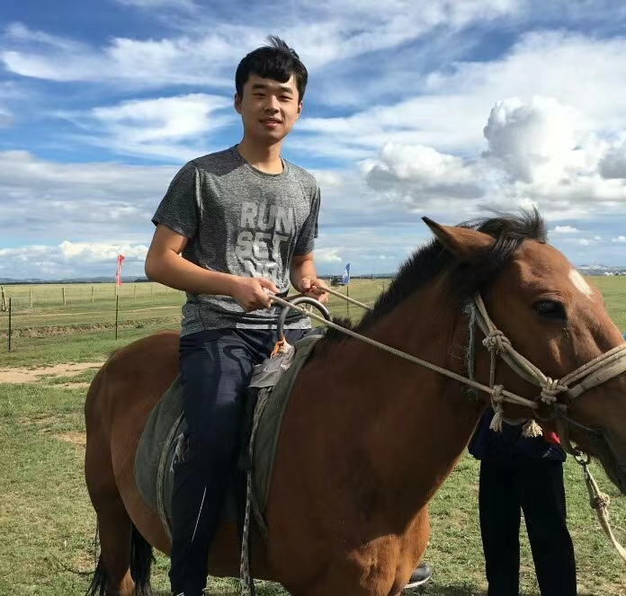

# Welcome to Yiqun Chen's homepage

    
    <figcaption>A Handsome Snapshot of My Equestrian Adventure</figcaption>

## About me

My name is Yiqun Chen (陈逸群, in Chinese). Currently, I am pursuing my Ph.D. at the Gaoling School of Artificial Intelligence, Renmin University of China, under the guidance of Professor [Jiaxin Mao](https://sites.google.com/site/maojiaxin/). Before this, I earned my Master’s degree from the Institute of Automation, Chinese Academy of Sciences, and my Bachelor’s degree from Shandong University. 

My research interests lie in Information Retrieval, including the Search Result Diversification (SRD), the application of Reinforcement Learning for Information Retrieval and Large Language Model for Ranking. Furthermore, I am also have the experience of Multi-Agent Reinforcement Learning (MARL).

If you are interested in my research or experience, please feel free to contact me.

## Contacts
* Email: chenyiqun990321@{ruc.edu.cn, gmail.com}
* Wechat: [13853687820](https://github.com/chenyiqun/chenyiqun.github.io/blob/main/Wechat.jpg)
* Twitter: [@chenyiqun223336](https://twitter.com/search?q=%40chenyiqun223336&src=typed_query)

## Educations

- **Ph.D. Candidate in Artificial Intelligence**
  - Gaoling School of Artificial Intelligence (GSAI), Remim University of China (RUC)
  - 2023 - 2027

- **M.Sc. in Pattern Recognition and Intelligent Systems**
  - Institute of Automation, Chinese Academy of Sciences (CASIA)
  - 2020 - 2023

- **B.Sc. in Automation**
  - Shandong University (SDU)
  - 2016 - 2020

## News

* **2025.1**: Two first-author paper is accepted by **WWW 2025**.
* **2024.4**: One first-author paper is accepted by **IJCAI 2024**.
* **2023.9**: I will join **Remin University of China** to pursue my Ph.D.
* **2023.4**: I will join the Search Department of **Baidu Inc.** as an algorithm intern.

## Publications

* **NeurIPS 2024** (submitted): **Chen Y**, Mao J, Zhang Y, et al. MA4DIV: Multi-Agent Reinforcement Learning for Search Result Diversification[J]. [arxiv](arXiv preprint arXiv:2403.17421, 2024.)
* **EMNLP 2024** (submitted):  **Chen Y**, Qi L, el al. Chen Y, Liu Q, Zhang Y, et al. TourRank: Utilizing Large Language Models for Documents Ranking with a Tournament-Inspired Strategy[J]. arXiv preprint arXiv:2406.11678, 2024.
* **IJCAI 2024** (accepted): **Chen Y**, Mao H, Zhang T, et al. Ptde: Personalized training with distillated execution for multi-agent reinforcement learning[J]. arXiv preprint arXiv:2210.08872, 2022.
* **IJCNN 2022** (accepted): **Chen Y**, Yang W, Zhang T, et al. Commander-Soldiers Reinforcement Learning for Cooperative Multi-Agent Systems[C]//2022 International Joint Conference on Neural Networks (IJCNN). IEEE, 2022: 1-7.
* **ICONIP 2022** (accepted, co-first author): Zhang B, **Chen Y**, et al. Multi-Agent Hyper-Attention Policy Optimization[C]//International Conference on Neural Information Processing. Cham: Springer International Publishing, 2022: 76-87.
* **AAMAS 2024** (accepted): Mao H, Zhao R, Li Z, **Chen Y**, et al. PDiT: Interleaving Perception and Decision-making Transformers for Deep Reinforcement Learning[J]. arXiv preprint arXiv:2312.15863, 2023.
* **ICONIP 2022** (accepted): Yang W, **Chen Y**, Sun J, et al. Deep Global and Local Matching Network for Implicit Recommendation[C]//International Conference on Neural Information Processing. Singapore: Springer Nature Singapore, 2022: 313-324.
  
## Preprints
* **MM 2024** (submitted): Yang W, **Chen Y**, et al. Bidirectional Cross-modal State Space Model with Self-distillation for Sequential Recommendation

## Internships

* 2023.5~now: Baidu Inc.
* 2022.4~2022.9: Huawei Noah's Ark Lab
* 2021.4~2021.7: DiDi Chuxing

## Awards
* 2023, Merit Student, University of Chinese Academy of Sciences
* 2020, Outstanding Graduates, Shandong Province
* 2018-2019, SAMSUNG Scholarship (only 10 recipients school-wide)
* 2017-2019, National Scholarship, Ministry of Education (2 times)
* 2016-2019, First-class Scholarship, Shandong University (3 times)

